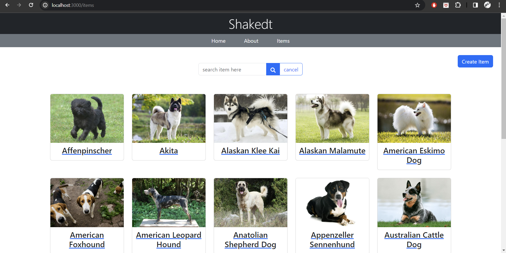

# Dog Themed React App

## Introduction

This React application was created as a project for a React course taken at Handesaim Ariel. The app features information and functionalities centered around dogs.

## Motivation

The idea for this app was born out of a combination of necessity and affection for dogs. Unable to find an interesting API for the project and being a dog lover, it seemed like the perfect opportunity to create something both useful and adorable.

## Features

- **Dog Information**: Detailed profiles for different dog breeds, including images and properties of them.
- **Interactive UI**: Users can interact with the app, such as adding their own dog profiles, editing existing ones, or deleting them.
- **Responsive Design**: The app is designed to be fully responsive, providing a seamless experience on both desktop and mobile devices.

## Technologies Used

- **React**: For building the user interface.
- **Bootstrap**: For styling and responsive design.
- **React Router**: For navigation within the application.

## Setup

To run this project, install it locally using npm:

```bash
$ git clone https://github.com/icestorm8/final-react-course-project.git
$ cd final-react-course-project
$ npm install
$ npm start
```

## Project Status

The project is currently in its final stages of development and is being prepared for presentation as part of the React course curriculum.

## Acknowledgements

- This project was created as part of a course at Handesaim Ariel.
- Special thanks to the instructor and peers who provided guidance and support throughout the course.

## License

This project is open source.

## Usage

> throughout the app the header and footer are visible, those include navbar and links to my github and linkedin, be sure to check those :&#41;

- home page
  

  > includes a link directing to items

- about page
  

- items page
  

  - in case of not having data (problem in fetching/ api response)
    
    > search bar is hidden and no data will be shown

- search in items

  > the search is based on the term entered inside the search bar. the term will be searched only after clicking on the search icon. to cancel the search, press the cancel button.
  > you can search for items one after the other. the whole data can be viewed only when the search was canceled ( = not active).
  > only if search term matches perfectlly to an item it will be shown!

  - searching (when there is a result)
    

  - searching (when no data matched the search)
    
    > make sure to cancel the search!

- viewing an item (by clicking on it)
  

  #### has 2 options inside:

  - editing an item (done only from item's page)
    
    

    > there are 2 options - submiting the form and saving the changes (if you made changes) or canceling changes made in form. both will close edit mode and display the dog's detailed profile.

  - deleting an item (done only from item's page) > when pressing delete you'll be redirected to items page, you can see that the item you deleted will not be visible there.
    here is an example of deleting "akita" from the list:
    | before | after |
    | :---: | :---: |
    |  |  |

- creating an item (from items page, was on navbar before)
  
  here is an example of adding new dog to the list:
  | before | after |
  | :---: | :---: |
  |  |  |

### when having an error fetching from the api :


- desided to not allow any addition of new items (redirecting back to items if there is an error)
- edit dog and view dog are taken care of and cannot be viewed (Redirecting and page not found(in case of searching for a dog name that doesn't exist))

#

```html
<pre>
    worked really hard on this
    hope you'll enjoy it too!
    ♥ ♥ ♥
    19/3/2024
</pre>
```
